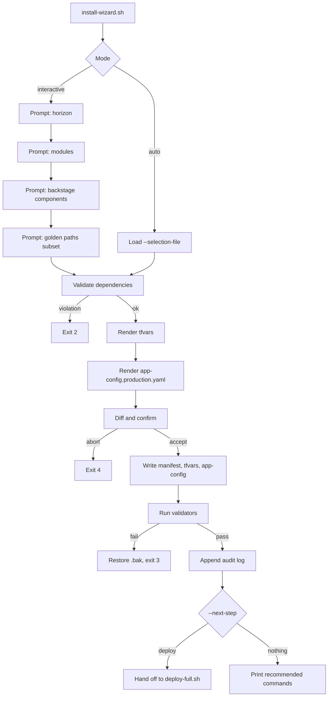
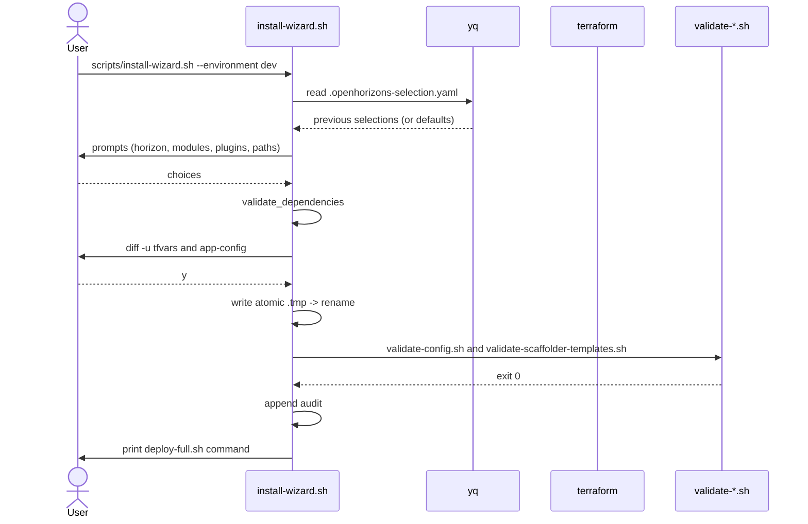

<!-- markdownlint-disable -->
# open-horizons-install-wizard-and-component-selection — Design

> Complete system design covering architecture, data, APIs, security, infrastructure, and decisions.

---

## 1. System Context (C4 Level 1)

> Who uses the system and what external systems does it integrate with?

Primary actor: a platform engineer or SRE preparing an Open Horizons installation in a client environment. Secondary actor: a CI/CD pipeline running the wizard in --auto mode. External systems: GitHub (via gh CLI), Azure (via az CLI), local Terraform CLI, the Backstage portal that consumes the regenerated app-config.production.yaml, and the existing scripts/deploy-full.sh and scripts/setup-identity-federation.sh handoffs.

---

## 2. Container Architecture (C4 Level 2)

> What are the deployable units (APIs, databases, queues, frontends) and how do they communicate?

No containers introduced. The wizard is a single script invoked from the developer workstation or CI runner. It depends on tools already present in scripts/validate-prerequisites.sh: bash 4+, yq, az, gh, terraform.

---

## 3. Component Design (C4 Level 3)

> What are the internal modules/services within each container and their responsibilities?

- Driver: install-wizard.sh in scripts/ that orchestrates the flow.\n- Selection loader: reads existing .openhorizons-selection.yaml if present and pre-fills defaults.\n- Interactive prompts: bash select-style menus for horizon, deployment mode, modules, plugins, agent APIs, MCP ecosystem; checkbox-style multi-select for Golden Paths grouped by horizon.\n- Validator: pure bash function that walks the selection map and returns a list of violated REQ-VALIDATE-001 rules.\n- Renderer (tfvars): consumes terraform/terraform.tfvars.example as template and substitutes values from the selection map.\n- Renderer (app-config): yq-based filter that rewrites catalog.locations preserving non-Golden-Path entries.\n- Audit: append-only write to .openhorizons-selection.history.\n- Handoff: emits commands to run scripts/deploy-full.sh and scripts/setup-identity-federation.sh.

---

## 4. Code-Level Design (C4 Level 4)

> Key classes, interfaces, patterns, and their relationships.

- selection_loader: parses an existing .openhorizons-selection.yaml via yq into associative arrays; returns defaults when the file is missing.\n- prompt_horizon, prompt_modules, prompt_backstage, prompt_paths: interactive prompts. Each function can be skipped if the corresponding flag is provided on the command line.\n- validate_dependencies: implements REQ-VALIDATE-001 rules as bash conditionals. Returns 0 (ok) or 2 (violation).\n- diff_and_confirm <file>: prints diff -u, asks y/n, honors --auto and --force.\n- write_manifest, write_tfvars, write_app_config: deterministic writers that always write to a .tmp file then rename to provide atomicity.\n- run_validators: executes validate-config.sh and validate-scaffolder-templates.sh, returning their exit codes.\n- emit_next_step: prints the deploy-full.sh and (when applicable) setup-identity-federation.sh commands derived from the chosen environment and horizon.

---

## 5. System Diagrams

### Wizard control flow

---

### Interactive run sequence

---

## 6. Data Model

> Entities, relationships, storage strategy, and data flow.

Selection manifest at .openhorizons-selection.yaml is a flat YAML document with a stable schema:\n- horizon: string enum h1|h2|h3|all\n- environment: string enum dev|staging|prod\n- deployment_mode: string enum express|standard|enterprise\n- modules: map<string, bool> of 11 enable_* flags currently in tfvars\n- backstage_components: map<string, bool> of 6 toggles (ai-chat plugin, four agent APIs, mcp-ecosystem)\n- golden_paths: list<string> of <horizon-prefix>/<template-name> identifiers, e.g. h1-foundation/basic-cicd\n\nDerived data:\n- tfvars rendered from the manifest plus terraform.tfvars.example.\n- app-config.production.yaml rendered from the existing file with catalog.locations filtered to selected golden_paths and non-Golden-Path catalog entries preserved verbatim.

---

## 7. API Contracts

> Endpoints, request/response schemas, authentication, and error codes.

### CLI scripts/install-wizard.sh

Run the wizard. With no flags it walks the user interactively. With --auto plus --selection-file it reads the manifest and applies it.

**Request:** scripts/install-wizard.sh [--environment dev|staging|prod] [--horizon h1|h2|h3|all] [--auto] [--selection-file <path>] [--dry-run] [--next-step deploy|nothing] [--force] [--help]

**Response:** stdout: human-readable progress, diff blocks, validation results, recommended next command. exit codes: 0=success, 1=usage error, 2=dependency rule violation, 3=validator failure, 4=user aborted at confirmation.

---

### FILE .openhorizons-selection.yaml

Manifest schema persisted at repo root.

**Request:** horizon: h1|h2|h3|all\nenvironment: dev|staging|prod\ndeployment_mode: express|standard|enterprise\nmodules:\n  enable_container_registry: bool\n  enable_databases: bool\n  enable_defender: bool\n  enable_purview: bool\n  enable_argocd: bool\n  enable_external_secrets: bool\n  enable_observability: bool\n  enable_github_runners: bool\n  enable_cost_management: bool\n  enable_ai_foundry: bool\n  enable_disaster_recovery: bool\nbackstage_components:\n  enable_ai_chat_plugin: bool\n  enable_agent_api: bool\n  enable_agent_api_impact: bool\n  enable_agent_api_maf: bool\n  enable_agent_api_sk: bool\n  enable_mcp_ecosystem: bool\ngolden_paths:\n  - h1-foundation/web-application\n  - h2-enhancement/microservice\n  - ...

**Response:** (persisted file)

---

### FILE .openhorizons-selection.history

Append-only audit log appended on every successful run.

**Request:** <iso8601-timestamp> <unix-user> <environment> sha256=<hex>

**Response:** (persisted file)

---

## 8. Infrastructure & Deployment

> How the system is deployed, scaled, monitored, and operated.

No new infrastructure. The wizard runs on the developer workstation or in CI. Required tools (bash 4+, yq, az, gh, terraform) are validated by scripts/validate-prerequisites.sh which the wizard invokes at startup.

---

## 9. Security Architecture

> Authentication, authorization, encryption, secrets management, and threat model.

- Authentication: not applicable; the wizard runs as the local user.\n- Authorization: relies on Azure RBAC and GitHub repository permissions when the user later runs deploy-full.sh and setup-identity-federation.sh.\n- Secret handling: REQ-OUTPUT-004 mandates that the manifest schema rejects keys starting with secret_, token_, password_; all sensitive values are sourced from TF_VAR_* environment variables and never echoed.\n- Threat model: misuse risks include accidental commit of an invalid app-config that breaks the catalog. Mitigations are validation gates and atomic file writes with .bak rollback.

---

## 10. Architecture Decision Records

### ADR-001: ADR-001 - Bash + yq for the wizard

**Decision:** Implement the wizard as a single bash script scripts/install-wizard.sh using yq for YAML manipulation and standard POSIX tools for everything else.

**Rationale:** Existing automation in the repo is bash-based (deploy-full.sh, validate-*.sh, setup-*.sh). Introducing a new language adds onboarding friction for the target audience (platform engineers).

**Consequences:** Pros: zero new runtime dependency, faster bootstrap, runs on macOS/Linux without extra setup. Cons: harder to unit test than a Go/Node alternative; YAML parsing relies on yq.

---

### ADR-002: ADR-002 - Flat YAML manifest at repo root

**Decision:** Use a flat YAML manifest with predefined keys (horizon, deployment_mode, modules, backstage_components, golden_paths, environment) committed at repo root as .openhorizons-selection.yaml.

**Rationale:** Keeps the manifest reviewable in PRs and amenable to yq filters. Avoids JSON schema migrations.

**Consequences:** Pros: easy to grep/diff, reproducible. Cons: cannot store nested objects without yq.

---

### ADR-003: ADR-003 - Templated tfvars generation from the example file

**Decision:** Generate the final terraform/environments/<env>.tfvars by templating from terraform/terraform.tfvars.example, layering manifest selections on top.

**Rationale:** The example file already documents every flag. Templating keeps the wizard simple and avoids re-implementing the schema.

**Consequences:** Pros: idempotent, deterministic output. Cons: must rerun the wizard if base example file changes.

---

### ADR-004: ADR-004 - Two-pass regeneration of app-config.production.yaml

**Decision:** Regenerate backstage/app-config.production.yaml in two passes: extract non-Golden-Path catalog blocks first, then append filtered Golden Path entries based on the manifest.

**Rationale:** REQ-OUTPUT-003 requires only selected templates to remain in catalog.locations while other catalog entries (org, examples) must be preserved.

**Consequences:** Pros: avoids manual edits to a critical config file, keeps drift visible in diffs. Cons: any non-Golden-Path catalog block must be carefully preserved by the regenerator.

---

### ADR-005: ADR-005 - Validation precedes mutation

**Decision:** Encode dependency rules (REQ-VALIDATE-001) as bash functions that return exit codes 0 (ok), 2 (rule violation). Validators run before any file write.

**Rationale:** Avoids partial writes when a rule fails (REQ-VALIDATE-002). Bash functions are easy to test individually.

**Consequences:** Pros: surfaces problems early, no clean-up needed if invalid. Cons: rules live in code; adding new rules requires editing the wizard.

---

### ADR-006: ADR-006 - CLI flag parity with deploy-full.sh

**Decision:** Reuse the deploy-full.sh CLI flag style: --environment, --horizon, --auto, --dry-run, plus wizard-only flags --selection-file, --next-step, --force.

**Rationale:** Clients already know deploy-full.sh syntax. Minimizes cognitive load.

**Consequences:** Pros: consistent UX with deploy-full.sh; one-flag mental model. Cons: more flags to document.

---

## 11. Error Handling Strategy

> How errors are detected, logged, propagated, and recovered from.

- Detection: every file write is validated by re-running validate-config.sh and validate-scaffolder-templates.sh. Failures abort and revert via .bak restoration.\n- Logging: all errors are printed to stderr with a structured prefix [WIZARD-ERR-<code>]. Stack-style trace is shown when DEBUG=1.\n- Propagation: shell exit codes are non-zero on any failure. The wizard never silently swallows errors.\n- Recovery: on any failure after a write, the latest .bak file is restored and the manifest update is rolled back.

---

## 12. Cross-Cutting Concerns

> Logging, monitoring, caching, configuration, feature flags, and observability.

- Logging: all output uses the same color helpers as scripts/deploy-full.sh and is duplicated to .openhorizons-selection.log when --log <path> is provided.\n- Configuration: manifest file is the only persisted configuration. Sensitive values are read only from environment variables.\n- Caching: none. Wizard is fast enough to recompute every run.\n- Error reporting: distinct exit codes per failure mode (1=usage, 2=rule violation, 3=validator failure, 4=user abort).\n- Time consistency: timestamps in audit history use UTC iso8601.

---

**Covers:** [TODO: requirement_references]
