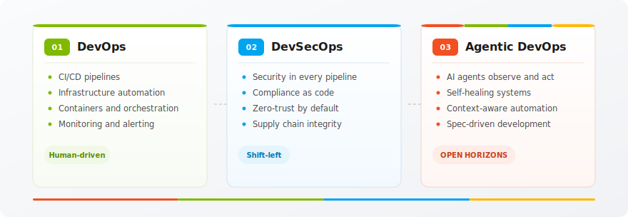
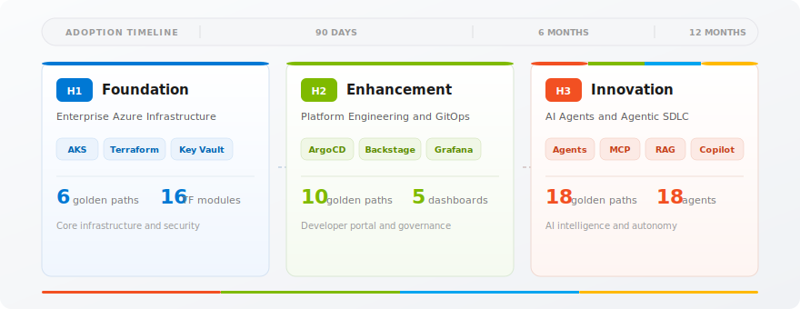
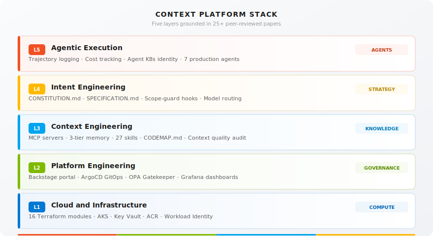
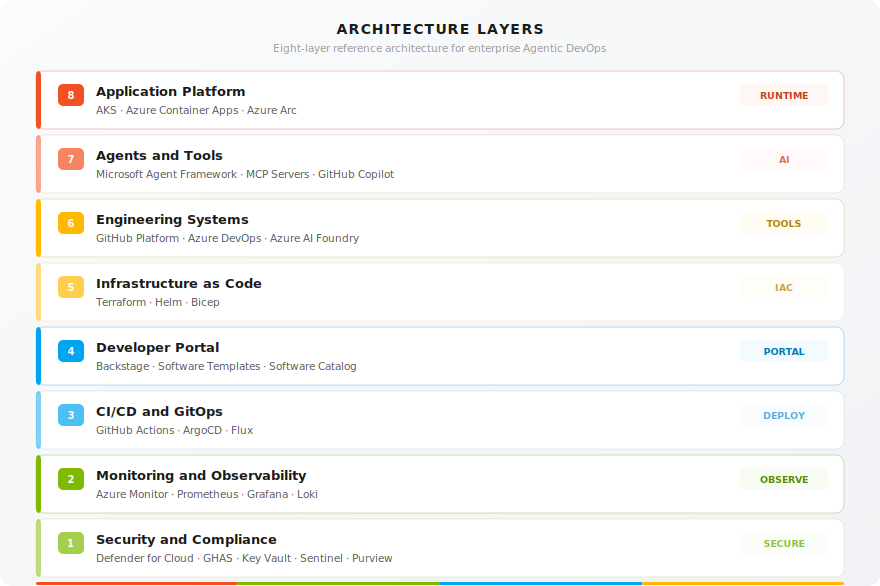

<div align="center">


# Open Horizons

### The open-source accelerator for building Agentic DevOps Platforms

Platform Engineering is the foundation layer for the AI-native enterprise. Without it, AI agents amplify the friction of the system they inherit. With it, they compound the system's capabilities. Open Horizons is the fastest path to operationalize that foundation.

Built on **Backstage**, **Azure**, and **GitHub**.

[](LICENSE)
[](https://backstage.io)
[](https://azure.microsoft.com)
[](https://github.com/features/copilot)

**34** Golden Paths | **19** AI Agents | **12** MCP Servers | **16** Terraform Modules

[Deploy Now](#get-started) | [Documentation](#documentation)

</div>

---

> **Public release for customers and partners.** This repository is the open, forkable reference implementation of the Open Horizons platform. Fork it into your own GitHub organization, run the install wizard, and deploy to your AKS cluster. See [Get Started](#get-started) below or jump straight to the [Master Installation Guide](docs/guides/MASTER_INSTALLATION.md).

---

## The Problem Open Horizons Solves

**95% of generative AI pilots in enterprise settings fail to deliver measurable value** (MIT NANDA, 2025). Not because models are weak, but because organizations lack the platform underneath.

The evidence is convergent:

- **DORA 2025**: AI coding assistants produce 98% more PRs in mature platforms, but 242% more incidents in weak ones. AI amplifies whatever you have.
- **Gartner 2025**: 40% of agentic AI projects will be cancelled by 2027 due to inadequate foundations.
- **IDC 2026**: 73% of enterprises planning agentic AI lack platform prerequisites. Of the 27% that have them, 61% are already in production.
- **Forrester 2026**: Enterprises with a productized platform compress time-to-first-AI-workload from 9-18 months to 90-180 days.

The pattern is clear: **the platform determines whether AI succeeds or fails**.

Open Horizons packages the four layers of the [Context Platform Stack](docs/context-engineer/) into a deployable, opinionated, open-source reference implementation:

```
Platform Engineering (foundation)
    + Open Horizons (accelerator)
    = Agentic DevOps Platform (outcome)
```

> Based on [25+ peer-reviewed papers](docs/context-engineer/) and the Context Platform Stack (Silva, 2026).

---

## What Is Inside

<table>
<tr>
<td width="50%">

### Developer IDP
- **34 Golden Paths** — scaffolding templates (H1, H2, H3)
- **Service Catalog** — every service, API, and owner
- **TechDocs** — documentation as code
- **DORA Metrics** — deployment velocity
- **Cost Insights** — per-service spend

</td>
<td width="50%">

### Agent IDP
- **18 Copilot Chat Agents** — role-based AI assistants
- **7 Runtime Agents** — production agentic APIs
- **12 MCP Server Tools** — context protocol integration
- **Trajectory Logging** — every decision recorded
- **Per-Agent Cost Tracking** — budget governance

</td>
</tr>
</table>

---

## The Evolution of DevOps

<div align="center">

</div>

---

## The Open Horizons Model

A structured maturity journey from foundational infrastructure to AI-powered innovation.

<div align="center">

</div>

---

## Agentic Intelligence

AI-powered agents built on Microsoft Agent Framework, integrated directly into the developer portal.

<table>
<tr>
<td width="50%">

### AI Chat
Conversational AI assistant for your entire SDLC. Get context-aware answers about infrastructure, pipelines, services, and platform.

**7 specialized agents:** Pipeline, Sentinel, Compass, Guardian, Lighthouse, Forge, Orchestrator

`Microsoft Agent Framework` `Azure AI Foundry`

</td>
<td width="50%">

### AI Impact
Measure the real impact of Agentic DevOps on your SDLC. KPI dashboards, score breakdowns, RAG-powered insights, and on-demand analysis.

**4 dimensions:** Adoption, Productivity, Velocity, Quality

`Impact Analytics` `DORA Correlation`

</td>
</tr>
</table>

---

## Key Differentiators

<table>
<tr>
<td width="33%">

**Open Source Portal**

Backstage as single pane of glass. Software catalog, Golden Paths, TechDocs, and AI chat in one place.

</td>
<td width="33%">

**Complete Automation**

Zero manual steps from Terraform plan to ArgoCD sync. GitOps with App-of-Apps and self-healing.

</td>
<td width="33%">

**Azure Native**

AKS, Key Vault, Azure Monitor, Workload Identity, Defender for Cloud. Cloud-native by design.

</td>
</tr>
<tr>
<td width="33%">

**AI-Powered Engineering**

Microsoft Agent Framework, MCP servers, DORA metrics correlation, and intelligent deployment decisions.

</td>
<td width="33%">

**Adoption Stages**

Start with H1 infrastructure, advance through H2 platform engineering, reach H3 AI innovation. At your own pace.

</td>
<td width="33%">

**Security by Default**

Zero-trust, Workload Identity, GHAS scanning, OPA Gatekeeper, private endpoints. Security is never optional.

</td>
</tr>
</table>

---

## The 4-Layer Context Platform Stack

<div align="center">

</div>

---

## Architecture Layers

<div align="center">

</div>

---

## Built for Every Team

<table>
<tr>
<td width="33%">

### Developer Teams
- Self-service Golden Paths
- AI-assisted coding with Copilot
- Inner loop tooling
- TechDocs and API catalog

</td>
<td width="33%">

### Platform Engineers
- Backstage portal management
- Terraform modules and GitOps
- DORA metrics and observability
- Copilot analytics

</td>
<td width="33%">

### Business Leaders
- AI maturity scoring
- Cost dashboards and optimization
- Compliance (SOC 2, PCI-DSS, CIS)
- Measurable DORA improvements

</td>
</tr>
</table>

---

## By the Numbers

| Component | Count | Layer |
|:----------|------:|:------|
| Golden Path Templates | 34 | L2 |
| Copilot Chat Agents | 19 | L5 |
| Skills (lazy-loaded) | 27 | L3 |
| Prompts | 16 | L3 |
| Terraform Modules | 16 | L1 |
| MCP Server Tools | 12 | L3 |
| Grafana Dashboards | 5 | L2 |
| OPA / Gatekeeper Policies | 8 | L2 |
| Runtime Agent APIs | 4 | L5 |

---

## Get Started

### 1. Fork & Clone

Fork this repository, then clone your fork:

```bash
# Fork via GitHub UI: https://github.com/Ohorizons/open-horizons-platform/fork
git clone https://github.com/<your-org>/open-horizons-platform
cd open-horizons-platform
```

### 2. Configure

```bash
cp .env.example .env
```

Edit `.env` with your organization's details:

| Variable | Description |
|:---------|:------------|
| `GITHUB_ORG`, `GITHUB_REPO` | Your GitHub organization and repo name |
| `DOMAIN` | Your custom domain (or use the default) |
| `AUTH_PROVIDER` | Authentication provider: `github`, `entra`, or `guest` |
| Azure details | Subscription, resource group, AKS cluster name |

Or use the **interactive wizard** to configure everything in one step:

```bash
scripts/install-wizard.sh
```

### 3. Generate & Deploy

```bash
# Generate K8s manifests from your .env config
scripts/render-k8s.sh

# Create the required K8s secrets
kubectl create secret generic backstage-secrets \
  --namespace backstage \
  --from-env-file=.env

# Deploy to your AKS cluster
kubectl apply -f backstage/k8s/
```

> **Pre-built images** — the platform uses public container images from `ghcr.io/ohorizons/*`, so no local build step is required.

Alternatively, use the Copilot deploy agent from VS Code:

```text
@deploy Deploy the platform to my AKS cluster
```

> Full guide: **[Master Installation Guide](docs/guides/MASTER_INSTALLATION.md)** | Deploy: **[Deployment Guide](docs/guides/DEPLOYMENT_GUIDE.md)**

---

## Documentation

| Guide | When to Use |
|:------|:------------|
| **[Master Installation Guide](docs/guides/MASTER_INSTALLATION.md)** | Single source of truth covering every layer and feature end to end |
| **[Deployment Guide](docs/guides/DEPLOYMENT_GUIDE.md)** | First deployment, step-by-step (3 options) |
| **[Wizard Guide](docs/guides/WIZARD_GUIDE.md)** | What developers see in Backstage and how the Azure deploy toggle works |
| **[Client Installation Guide](docs/guides/CLIENT_INSTALLATION.md)** | Template-receive checklist (fork, branding, branch strategy) |
| **[Architecture Guide](docs/guides/ARCHITECTURE_GUIDE.md)** | Understanding the system design |
| **[Administrator Guide](docs/guides/ADMINISTRATOR_GUIDE.md)** | Day-2 operations |
| **[Agent System](AGENTS.md)** | 19 agents, 27 skills, 16 prompts |
| **[Code Map](CODEMAP.md)** | Navigating the codebase |
| **[Context Platform Stack](docs/context-engineer/)** | The intellectual foundation (6 chapters) |
| **[Module Reference](docs/guides/MODULE_REFERENCE.md)** | All 16 Terraform modules |
| **[Troubleshooting](docs/guides/TROUBLESHOOTING_GUIDE.md)** | Problem diagnosis |
| **[Contributing](CONTRIBUTING.md)** | How to contribute |
| **[Security](SECURITY.md)** | Security policy and practices |

---

## Built With

<table>
<tr>
<td align="center"><strong>Infrastructure</strong></td>
<td align="center"><strong>Platform</strong></td>
<td align="center"><strong>AI and Agents</strong></td>
<td align="center"><strong>Observability</strong></td>
</tr>
<tr>
<td>

- Azure AKS
- Terraform
- Key Vault
- ACR
- Workload Identity

</td>
<td>

- Backstage OSS
- ArgoCD
- OPA Gatekeeper
- GitHub Actions
- MCP Protocol

</td>
<td>

- Azure AI Foundry
- GitHub Copilot
- Microsoft Agent Framework
- Semantic Kernel
- 18 Copilot Chat Agents

</td>
<td>

- Prometheus
- Grafana
- Alertmanager
- Trajectory Logging
- Cost Attribution

</td>
</tr>
</table>

---

<div align="center">


### Ready to Transform Your SDLC?

Deploy Open Horizons and bring Agentic DevOps to your organization.

[Deploy Now](#get-started) | [GitHub](https://github.com/Ohorizons/ohorizons-demo)

*Open Horizons — Agentic DevOps Platform Accelerator*

*Created by [Paula Silva](https://github.com/paulasilvatech)*

</div>
