# Open Horizons Platform - Troubleshooting Guide

> **Version:** 4.0.0
> **Last Updated:** March 2026
> **Audience:** Platform Engineers, DevOps Engineers, Support Teams

---

## Table of Contents

1. [How to Use This Guide](#1-how-to-use-this-guide)
2. [Quick Diagnostics](#2-quick-diagnostics)
3. [Terraform Issues](#3-terraform-issues)
4. [AKS Cluster Issues](#4-aks-cluster-issues)
5. [Pod and Workload Issues](#5-pod-and-workload-issues)
6. [ArgoCD and GitOps Issues](#6-argocd-and-gitops-issues)
7. [Networking Issues](#7-networking-issues)
8. [External Secrets Issues](#8-external-secrets-issues)
9. [Observability Issues](#9-observability-issues)
10. [AI Foundry Issues](#10-ai-foundry-issues)
11. [Authentication and Authorization Issues](#11-authentication-and-authorization-issues)
12. [Performance Issues](#12-performance-issues)
13. [Error Message Reference](#13-error-message-reference)
14. [Support and Escalation](#14-support-and-escalation)

---

## 1. How to Use This Guide

### 1.1 Troubleshooting Methodology

Before diving into specific issues, understand the general approach:

> 💡 **The IDEA Troubleshooting Method**
>
> **I**dentify → **D**iagnose → **E**xecute → **A**ssess
>
> 1. **Identify**: What's the symptom? What changed recently?
> 2. **Diagnose**: Gather data, form hypothesis
> 3. **Execute**: Apply the fix
> 4. **Assess**: Did it work? Document for future reference

### 1.2 Decision Tree: Where to Start

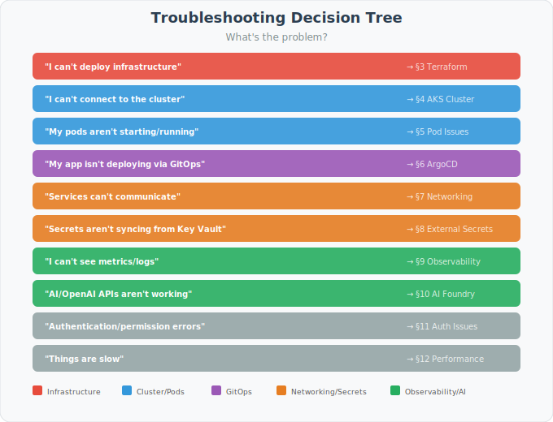

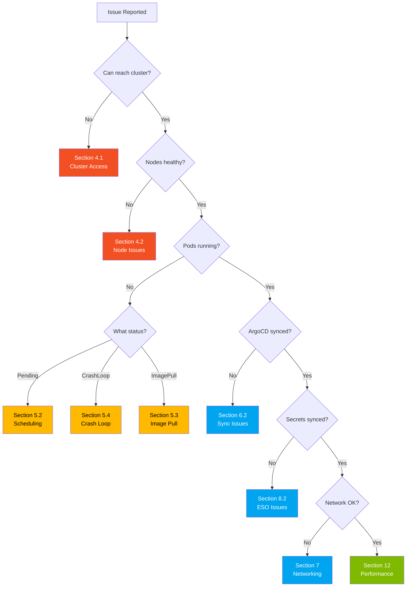

### 1.3 Severity Classification

> 💡 **Understanding Severity Levels**
>
> | Severity | Description | Response Time | Example |
> | ---------- | ------------- | --------------- | --------- |
> | **SEV1** | Production down, all users affected | 15 minutes | Cluster unreachable |
> | **SEV2** | Significant impact, workaround exists | 1 hour | Deployment failing |
> | **SEV3** | Minor impact, one user/feature | 4 hours | Dashboard not loading |
> | **SEV4** | Minimal impact | Next business day | Cosmetic issue |

---

## 2. Quick Diagnostics

### 2.1 The 5-Minute Health Check

Before investigating specific issues, run this quick check:

```bash
#!/bin/bash
# Run this first for any issue
# Save as: scripts/quick-check.sh

echo "╔══════════════════════════════════════════════════════════════╗"
echo "║          OPEN HORIZONS - QUICK DIAGNOSTIC CHECK             ║"
echo "╚══════════════════════════════════════════════════════════════╝"
echo ""
echo "Timestamp: $(date -u +"%Y-%m-%dT%H:%M:%SZ")"
echo ""

# 1. Can we reach the cluster?
echo "┌─────────────────────────────────────────────────────────────┐"
echo "│ 1. CLUSTER CONNECTIVITY                                     │"
echo "└─────────────────────────────────────────────────────────────┘"
if kubectl cluster-info &> /dev/null; then
    echo "✅ Cluster is reachable"
    kubectl cluster-info | head -2
else
    echo "❌ CANNOT CONNECT TO CLUSTER"
    echo "   → Check: kubectl config current-context"
    echo "   → Try: az aks get-credentials -g <RG> -n <CLUSTER>"
    exit 1
fi
echo ""

# 2. Are nodes healthy?
echo "┌─────────────────────────────────────────────────────────────┐"
echo "│ 2. NODE STATUS                                              │"
echo "└─────────────────────────────────────────────────────────────┘"
NOT_READY=$(kubectl get nodes --no-headers | grep -v Ready | wc -l)
if [ "$NOT_READY" -eq 0 ]; then
    echo "✅ All nodes are Ready"
else
    echo "⚠️  $NOT_READY node(s) NOT Ready:"
    kubectl get nodes | grep -v Ready
fi
kubectl get nodes -o wide
echo ""

# 3. Are there failing pods?
echo "┌─────────────────────────────────────────────────────────────┐"
echo "│ 3. POD HEALTH                                               │"
echo "└─────────────────────────────────────────────────────────────┘"
FAILING=$(kubectl get pods -A --field-selector=status.phase!=Running,status.phase!=Succeeded --no-headers 2>/dev/null | wc -l)
if [ "$FAILING" -eq 0 ]; then
    echo "✅ All pods are Running or Succeeded"
else
    echo "⚠️  $FAILING pod(s) in problematic state:"
    kubectl get pods -A --field-selector=status.phase!=Running,status.phase!=Succeeded
fi
echo ""

# 4. Recent warning events
echo "┌─────────────────────────────────────────────────────────────┐"
echo "│ 4. RECENT WARNING EVENTS (last 10)                          │"
echo "└─────────────────────────────────────────────────────────────┘"
WARNINGS=$(kubectl get events -A --field-selector type=Warning --no-headers 2>/dev/null | wc -l)
if [ "$WARNINGS" -eq 0 ]; then
    echo "✅ No warning events"
else
    echo "⚠️  Found $WARNINGS warning event(s). Most recent:"
    kubectl get events -A --field-selector type=Warning --sort-by='.lastTimestamp' 2>&1 | tail -10
fi
echo ""

# 5. Resource utilization
echo "┌─────────────────────────────────────────────────────────────┐"
echo "│ 5. RESOURCE UTILIZATION                                     │"
echo "└─────────────────────────────────────────────────────────────┘"
if kubectl top nodes &> /dev/null; then
    kubectl top nodes
else
    echo "⚠️  Metrics server not available (kubectl top failed)"
fi
echo ""

# 6. ArgoCD status
echo "┌─────────────────────────────────────────────────────────────┐"
echo "│ 6. ARGOCD APPLICATION STATUS                                │"
echo "└─────────────────────────────────────────────────────────────┘"
if kubectl get ns argocd &> /dev/null; then
    UNHEALTHY=$(kubectl get applications -n argocd --no-headers 2>/dev/null | grep -v "Healthy" | wc -l)
    if [ "$UNHEALTHY" -eq 0 ]; then
        echo "✅ All ArgoCD applications healthy"
    else
        echo "⚠️  $UNHEALTHY application(s) not healthy:"
    fi
    kubectl get applications -n argocd 2>/dev/null
else
    echo "ℹ️  ArgoCD not installed"
fi
echo ""

# 7. External Secrets status
echo "┌─────────────────────────────────────────────────────────────┐"
echo "│ 7. EXTERNAL SECRETS STATUS                                  │"
echo "└─────────────────────────────────────────────────────────────┘"
if kubectl get ns external-secrets &> /dev/null; then
    FAILING_ES=$(kubectl get externalsecrets -A --no-headers 2>/dev/null | grep -v "SecretSynced" | wc -l)
    if [ "$FAILING_ES" -eq 0 ]; then
        echo "✅ All ExternalSecrets synced"
    else
        echo "⚠️  $FAILING_ES ExternalSecret(s) not synced:"
        kubectl get externalsecrets -A 2>/dev/null | grep -v "SecretSynced"
    fi
else
    echo "ℹ️  External Secrets Operator not installed"
fi
echo ""

echo "╔══════════════════════════════════════════════════════════════╗"
echo "║                    END DIAGNOSTIC CHECK                      ║"
echo "╚══════════════════════════════════════════════════════════════╝"
```

### 2.2 Quick Diagnostic Commands Reference

| What to Check | Command | What It Shows |
| --------------- | --------- | --------------- |
| Cluster access | `kubectl cluster-info` | API server connectivity |
| Node status | `kubectl get nodes -o wide` | Node health and IPs |
| All pods | `kubectl get pods -A` | Pod status across namespaces |
| Events | `kubectl get events -A --sort-by='.lastTimestamp'` | Recent cluster events |
| Resources | `kubectl top nodes && kubectl top pods -A` | CPU/memory usage |
| Services | `kubectl get svc -A` | Service endpoints |
| ArgoCD apps | `kubectl get applications -n argocd` | GitOps sync status |
| Secrets sync | `kubectl get externalsecrets -A` | Secret sync status |

---

## 3. Terraform Issues

### 3.1 Understanding Terraform Errors

> 💡 **How Terraform Works**
>
> Terraform maintains a **state file** that tracks what resources exist.
> When you run `terraform apply`, it:
>
> 1. Reads the state file
> 2. Compares with your `.tf` files
> 3. Plans changes (create, update, delete)
> 4. Applies changes to Azure
> 5. Updates state file
>
> Most Terraform errors fall into these categories:
>
> - **State issues**: State file out of sync with reality
> - **Auth issues**: Can't authenticate to Azure
> - **Conflict issues**: Resource already exists outside Terraform
> - **Quota issues**: Azure limits exceeded

### 3.2 "Failed to Get Existing Workspaces" Error

```text
Error: Failed to get existing workspaces: storage: service returned error
StatusCode=403, ErrorCode=AuthorizationFailure
```

> 💡 **What This Means**
>
> Terraform stores its state in an Azure Storage Account. This error means
> Terraform can't access that storage account.

**Investigation Steps:**

```bash
# Step 1: Check if you're logged in
az account show
# If error: Run "az login"

# Step 2: Verify subscription
az account list --output table
# Make sure the correct subscription is set

# Step 3: Check storage account exists
az storage account show \
  --name $STORAGE_ACCOUNT_NAME \
  --resource-group $RG_NAME

# Step 4: Check your permissions
az role assignment list \
  --assignee $(az account show --query user.name -o tsv) \
  --scope "/subscriptions/$SUBSCRIPTION_ID/resourceGroups/$RG_NAME/providers/Microsoft.Storage/storageAccounts/$STORAGE_ACCOUNT_NAME"
```

**Solutions:**

| Cause | Solution |
| ------- | ---------- |
| Not logged in | `az login && az account set -s $SUBSCRIPTION_ID` |
| Wrong subscription | `az account set --subscription $CORRECT_SUBSCRIPTION` |
| Missing permissions | Request "Storage Blob Data Contributor" role |
| Firewall blocking | Add your IP to storage account firewall |
| VPN required | Connect to VPN, then retry |

**Fix Commands:**

```bash
# Clear and reinitialize
rm -rf .terraform .terraform.lock.hcl
az login
az account set --subscription $SUBSCRIPTION_ID
terraform init -reconfigure
```

### 3.3 "Error Acquiring the State Lock" Error

```text
Error: Error acquiring the state lock

Error message: state blob is already locked

Lock Info:
  ID:        xxxxxxxx-xxxx-xxxx-xxxx-xxxxxxxxxxxx
  Created:   2024-01-15 10:30:00.000000000 +0000 UTC
```

> 💡 **What This Means**
>
> Terraform uses locks to prevent concurrent modifications. This error occurs when:
>
> - Another `terraform apply` is running
> - A previous run crashed without releasing the lock
> - Someone else is running Terraform on the same state

**Investigation Steps:**

```bash
# Step 1: Check if another process is running
ps aux | grep terraform

# Step 2: Ask team members if they're running Terraform

# Step 3: Check how old the lock is
# (Look at the "Created" timestamp in the error message)
```

**Decision Tree:**

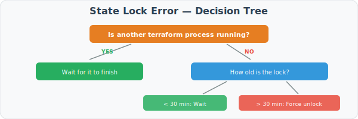

**Solutions:**

```bash
# Option 1: Force unlock (use the ID from the error message)
terraform force-unlock xxxxxxxx-xxxx-xxxx-xxxx-xxxxxxxxxxxx

# Option 2: Break lease directly in Azure
az storage blob lease break \
  --blob-name terraform.tfstate \
  --container-name tfstate \
  --account-name $STORAGE_ACCOUNT_NAME

# Then reinitialize
terraform init
```

> ⚠️ **Warning: Force Unlock**
>
> Only use `force-unlock` if you're CERTAIN no one else is running Terraform.
> Running two applies simultaneously can corrupt your state!

### 3.4 "Resource Already Exists" Error

```text
Error: A resource with the ID "/subscriptions/.../resourceGroups/rg-contoso-dev"
already exists - to be managed via Terraform this resource needs to be imported
into the State.
```

> 💡 **What This Means**
>
> Someone (or something) created a resource in Azure that Terraform wants to create.
> Terraform sees the resource doesn't exist in state, but it does exist in Azure.

**Investigation Steps:**

```bash
# Step 1: Verify the resource exists in Azure
az group show --name rg-contoso-dev

# Step 2: Check if it's in Terraform state
terraform state list | grep resource_group

# Step 3: Understand who created it
# Check Azure Activity Log in portal
```

**Solutions:**

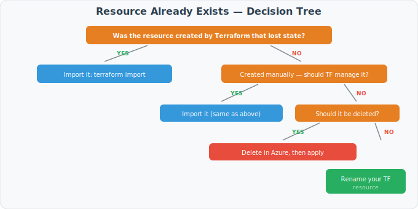

**Import Examples:**

```bash
# Import resource group
terraform import azurerm_resource_group.main \
  /subscriptions/$SUB_ID/resourceGroups/rg-contoso-dev

# Import AKS cluster
terraform import module.aks.azurerm_kubernetes_cluster.main \
  /subscriptions/$SUB_ID/resourceGroups/$RG/providers/Microsoft.ContainerService/managedClusters/$CLUSTER_NAME

# Import Key Vault
terraform import module.security.azurerm_key_vault.main \
  /subscriptions/$SUB_ID/resourceGroups/$RG/providers/Microsoft.KeyVault/vaults/$KV_NAME
```

### 3.5 "Quota Exceeded" Error

```text
Error: creating/updating Kubernetes Cluster: compute.VirtualMachineScaleSetsClient#CreateOrUpdate:
Code="QuotaExceeded" Message="Quota for resource StandardDSv3Family exceeded."
```

> 💡 **What This Means**
>
> Every Azure subscription has quotas (limits) on resources. This error means
> you've hit a limit - usually on VM cores.

**Check Current Quotas:**

```bash
# Check VM quotas in your region
az vm list-usage --location brazilsouth --output table

# Look for the family mentioned in the error
az vm list-usage --location brazilsouth --output table | grep "Standard DSv3"
```

**Solutions:**

| Option | Steps |
| -------- | ------- |
| Request quota increase | Azure Portal → Subscriptions → Usage + quotas → Request increase |
| Use different VM size | Change `vm_size` in Terraform to a family with available quota |
| Use different region | Deploy to a region with more capacity |
| Clean up unused VMs | Delete unused resources to free up quota |

**Temporary Workaround - Use Smaller VMs:**

```hcl
# In terraform.tfvars, temporarily use smaller VMs
system_node_pool = {
  name       = "system"
  vm_size    = "Standard_D2s_v5"  # Changed from D4s_v5
  node_count = 2                   # Changed from 3
  zones      = ["1", "2"]          # Changed from 3 zones
}
```

---

## 4. AKS Cluster Issues

### 4.1 Cannot Connect to Cluster

**Symptoms:**

```text
Unable to connect to the server: dial tcp: lookup aks-xxx.hcp.brazilsouth.azmk8s.io: no such host
```

or

```text
Unable to connect to the server: dial tcp 10.0.0.1:443: i/o timeout
```

> 💡 **Understanding Cluster Access**
>
> When you run `kubectl`, it:
>
> 1. Reads `~/.kube/config` for cluster information
> 2. Connects to the AKS API server
> 3. Authenticates using Azure AD (for managed clusters)
>
> Connection failures happen when any of these steps fail.

**Diagnostic Flowchart:**

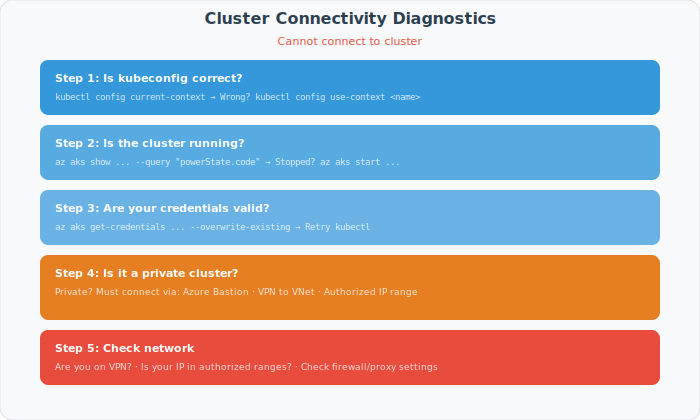

**Quick Fixes:**

```bash
# Fix 1: Refresh credentials
az aks get-credentials \
  --resource-group $RG \
  --name $CLUSTER \
  --overwrite-existing

# Fix 2: Start stopped cluster
az aks start --resource-group $RG --name $CLUSTER

# Fix 3: Check and update authorized IPs
MY_IP=$(curl -s https://ifconfig.me)
az aks update \
  --resource-group $RG \
  --name $CLUSTER \
  --api-server-authorized-ip-ranges "$MY_IP/32"

# Fix 4: Use admin credentials (emergency only)
az aks get-credentials \
  --resource-group $RG \
  --name $CLUSTER \
  --admin
```

### 4.2 Nodes Not Ready

**Symptom:**

```text
NAME                              STATUS     ROLES   AGE   VERSION
aks-system-12345678-vmss000000    Ready      agent   10d   v1.29.0
aks-system-12345678-vmss000001    NotReady   agent   10d   v1.29.0
aks-system-12345678-vmss000002    Ready      agent   10d   v1.29.0
```

> 💡 **Understanding Node Status**
>
> Kubernetes nodes report various "conditions" that affect their Ready status:
>
> | Condition | What It Means |
> | ----------- | --------------- |
> | Ready | Node is healthy and can accept pods |
> | MemoryPressure | Node is running low on memory |
> | DiskPressure | Node is running low on disk space |
> | PIDPressure | Too many processes running |
> | NetworkUnavailable | Network not configured correctly |
>
> If ANY condition (except Ready) is True, the node becomes NotReady.

**Investigation:**

```bash
# Step 1: Get detailed node status
kubectl describe node aks-system-12345678-vmss000001

# Look for:
# - Conditions section (what's wrong)
# - Events section (recent issues)

# Step 2: Check specific conditions
kubectl get node aks-system-12345678-vmss000001 -o jsonpath='{.status.conditions[*]}' | jq .

# Step 3: Check resource usage
kubectl top node aks-system-12345678-vmss000001
```

**Solutions by Condition:**

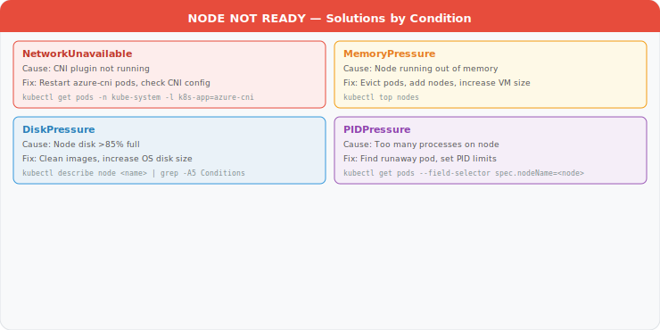

**Emergency: Cordon, Drain, and Replace Node:**

```bash
# Step 1: Prevent new pods from scheduling
kubectl cordon aks-system-12345678-vmss000001

# Step 2: Safely evict existing pods
kubectl drain aks-system-12345678-vmss000001 \
  --ignore-daemonsets \
  --delete-emptydir-data \
  --force

# Step 3: Get node VMSS info
NODE_RG=$(az aks show -g $RG -n $CLUSTER --query nodeResourceGroup -o tsv)
VMSS_NAME=$(kubectl get node aks-system-12345678-vmss000001 \
  -o jsonpath='{.spec.providerID}' | cut -d'/' -f9)
INSTANCE_ID=$(kubectl get node aks-system-12345678-vmss000001 \
  -o jsonpath='{.spec.providerID}' | cut -d'/' -f11)

# Step 4: Delete the problematic instance (new one will be created)
az vmss delete-instances \
  --resource-group $NODE_RG \
  --name $VMSS_NAME \
  --instance-ids $INSTANCE_ID

# Step 5: Wait for new node and uncordon
# (The nodepool will automatically create a replacement)
```

### 4.3 AKS Upgrade Issues

**Symptom:**

```text
Error: UpgradeFailed: Upgrade operation failed. Please check that your cluster
is healthy before retrying the upgrade operation.
```

> 💡 **Understanding AKS Upgrades**
>
> AKS upgrades work by:
>
> 1. Upgrading control plane (API server, etc.)
> 2. Creating new nodes with new version (one at a time by default)
> 3. Cordoning and draining old nodes
> 4. Deleting old nodes
>
> Failures usually occur in step 3 when pods can't be drained.

**Pre-Upgrade Checklist:**

```bash
# 1. Check current version and available upgrades
az aks get-upgrades --resource-group $RG --name $CLUSTER --output table

# 2. Check cluster health
kubectl get nodes
kubectl get pods -A | grep -v Running | grep -v Completed

# 3. Check PodDisruptionBudgets (these can block drains)
kubectl get pdb -A

# 4. Check for stuck pods
kubectl get pods -A --field-selector=status.phase=Pending
kubectl get pods -A | grep -E "Terminating|Unknown"
```

**Fix Stuck Upgrade:**

```bash
# Step 1: Check what's blocking
az aks show -g $RG -n $CLUSTER --query "provisioningState"

# Step 2: If stuck on node drain, find problem pods
kubectl get pods -A -o wide --field-selector spec.nodeName=$DRAINING_NODE

# Step 3: Force delete stuck pods (if safe)
kubectl delete pod $POD_NAME -n $NAMESPACE --force --grace-period=0

# Step 4: Resume upgrade if needed
az aks upgrade \
  --resource-group $RG \
  --name $CLUSTER \
  --kubernetes-version $TARGET_VERSION
```

---

## 5. Pod and Workload Issues

### 5.1 Pod Status Reference

> 💡 **Understanding Pod Statuses**
>
> ```text
> Pod Lifecycle:
>
> Pending ─────► Running ─────► Succeeded
>     │             │              (for Jobs)
>     │             │
>     │             └─────► Failed
>     │
>     └─► (stuck) - See troubleshooting below
>
> Problematic Statuses:
> - Pending: Waiting to be scheduled
> - ImagePullBackOff: Can't pull container image
> - CrashLoopBackOff: Container keeps crashing
> - Error: Container exited with error
> - Terminating: Pod stuck during deletion
> ```

### 5.2 Pods Stuck in Pending

**Symptom:**

```text
NAME           READY   STATUS    RESTARTS   AGE
my-app-xxx     0/1     Pending   0          15m
```

**Investigation:**

```bash
# Step 1: Get events for the pod
kubectl describe pod my-app-xxx -n my-namespace

# Look for events like:
# - "0/6 nodes are available: 3 Insufficient cpu, 3 Insufficient memory"
# - "pod has unbound immediate PersistentVolumeClaims"
# - "0/6 nodes are available: 6 node(s) didn't match node selector"
```

**Solutions by Event Message:**

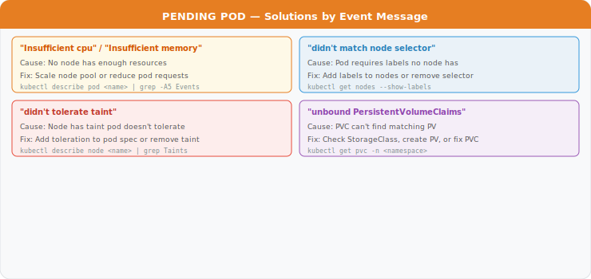

### 5.3 ImagePullBackOff

**Symptom:**

```text
NAME           READY   STATUS             RESTARTS   AGE
my-app-xxx     0/1     ImagePullBackOff   0          5m
```

> 💡 **What This Means**
>
> Kubernetes cannot pull the container image. The "BackOff" means it's
> waiting with increasing delays between retry attempts.

**Investigation:**

```bash
# Step 1: Get the exact error
kubectl describe pod my-app-xxx -n my-namespace | grep -A 10 "Events:"

# Common errors:
# - "repository does not exist or may require authentication"
# - "manifest for image:tag not found"
# - "unauthorized: authentication required"
```

**Diagnostic Flow:**

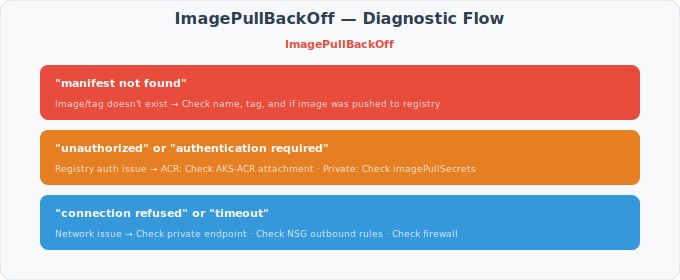

**Solutions:**

```bash
# Fix 1: Verify image exists
az acr repository show-tags \
  --name $ACR_NAME \
  --repository myapp \
  --output table

# Fix 2: Attach ACR to AKS (if not already)
az aks update \
  --resource-group $RG \
  --name $CLUSTER \
  --attach-acr $ACR_NAME

# Fix 3: Create imagePullSecret for private registry
kubectl create secret docker-registry acr-secret \
  --docker-server=$ACR_NAME.azurecr.io \
  --docker-username=$CLIENT_ID \
  --docker-password=$CLIENT_SECRET \
  --namespace=my-namespace

# Then add to pod spec:
# spec:
#   imagePullSecrets:
#     - name: acr-secret

# Fix 4: Check private endpoint (if using Premium ACR)
kubectl run debug --rm -it --image=busybox -- \
  nslookup $ACR_NAME.azurecr.io
# Should resolve to private IP (10.x.x.x)
```

### 5.4 CrashLoopBackOff

**Symptom:**

```text
NAME           READY   STATUS             RESTARTS     AGE
my-app-xxx     0/1     CrashLoopBackOff   5 (2m ago)   10m
```

> 💡 **What This Means**
>
> The container starts but then crashes. Kubernetes keeps restarting it,
> but with increasing delays (the "backoff" part):
>
> - 1st crash: wait 10s
> - 2nd crash: wait 20s
> - 3rd crash: wait 40s
> - ... up to 5 minutes between attempts

**Investigation:**

```bash
# Step 1: Check current logs
kubectl logs my-app-xxx -n my-namespace

# Step 2: Check logs from previous crash
kubectl logs my-app-xxx -n my-namespace --previous

# Step 3: Get exit code
kubectl get pod my-app-xxx -n my-namespace \
  -o jsonpath='{.status.containerStatuses[0].lastState.terminated.exitCode}'

# Step 4: Check events
kubectl describe pod my-app-xxx -n my-namespace | tail -20
```

**Exit Code Reference:**

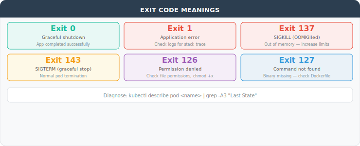

**Solutions:**

```bash
# Fix 1: Debug interactively (override entrypoint)
kubectl run debug --rm -it \
  --image=$IMAGE \
  --overrides='{"spec":{"containers":[{"name":"debug","command":["sleep","infinity"]}]}}' \
  -- /bin/sh

# Fix 2: Add more memory (for OOMKilled)
# In deployment.yaml:
# resources:
#   limits:
#     memory: "1Gi"  # Increase from previous value

# Fix 3: Fix liveness probe (if exit code 137 not from OOM)
# In deployment.yaml:
# livenessProbe:
#   initialDelaySeconds: 60  # Give app more time to start
#   periodSeconds: 30
#   failureThreshold: 3

# Fix 4: Check required environment variables
kubectl set env deployment/my-app --list -n my-namespace
```

### 5.5 Pods Stuck in Terminating

**Symptom:**

```text
NAME           READY   STATUS        RESTARTS   AGE
my-app-xxx     0/1     Terminating   0          30m
```

> 💡 **What This Means**
>
> When you delete a pod, Kubernetes:
>
> 1. Sends SIGTERM to containers
> 2. Waits for graceful shutdown (default 30s)
> 3. Sends SIGKILL if still running
> 4. Removes the pod from API
>
> "Stuck in Terminating" usually means finalizers are blocking deletion
> or the node is unreachable.

**Investigation:**

```bash
# Check for finalizers
kubectl get pod my-app-xxx -n my-namespace -o jsonpath='{.metadata.finalizers}'

# Check which node the pod is on
kubectl get pod my-app-xxx -n my-namespace -o jsonpath='{.spec.nodeName}'

# Is the node reachable?
kubectl get node <node-name>
```

**Solutions:**

```bash
# Option 1: Force delete (safe for stateless apps)
kubectl delete pod my-app-xxx -n my-namespace --force --grace-period=0

# Option 2: Remove finalizers (if that's blocking)
kubectl patch pod my-app-xxx -n my-namespace \
  -p '{"metadata":{"finalizers":[]}}' --type=merge

# Option 3: If node is unreachable, delete the node
# (Pods will be recreated on healthy nodes)
kubectl delete node <unreachable-node>
```

---

## 6. ArgoCD and GitOps Issues

### 6.1 Understanding ArgoCD Sync Status

> 💡 **ArgoCD Status Meanings**
>
> ```text
> ┌─────────────────────────────────────────────────────────────────┐
> │                    ARGOCD STATUS MATRIX                         │
> ├─────────────────────────────────────────────────────────────────┤
> │                                                                 │
> │  SYNC STATUS:                                                   │
> │  ────────────                                                   │
> │  Synced      = Git matches cluster (good!)                      │
> │  OutOfSync   = Git differs from cluster                         │
> │  Unknown     = ArgoCD can't determine status                    │
> │                                                                 │
> │  HEALTH STATUS:                                                 │
> │  ──────────────                                                 │
> │  Healthy     = All resources working (good!)                    │
> │  Progressing = Resources are starting/updating                  │
> │  Degraded    = Some resources have issues                       │
> │  Suspended   = Resources are paused (e.g., scaling to 0)        │
> │  Missing     = Resources don't exist in cluster                 │
> │  Unknown     = Can't determine health                           │
> │                                                                 │
> │  COMMON COMBINATIONS:                                           │
> │  ────────────────────                                           │
> │  Synced + Healthy     = Everything working                      │
> │  OutOfSync + Healthy  = Running old version, update available   │
> │  Synced + Progressing = Just synced, waiting for rollout        │
> │  Synced + Degraded    = Synced but app is broken                │
> │  OutOfSync + Degraded = Need sync AND app is broken             │
> │                                                                 │
> └─────────────────────────────────────────────────────────────────┘
> ```

### 6.2 Application OutOfSync

**Symptom:**

```text
NAME     SYNC STATUS   HEALTH STATUS
my-app   OutOfSync     Healthy
```

**Investigation:**

```bash
# Step 1: See what's different
argocd app diff my-app

# Or via kubectl
kubectl get application my-app -n argocd \
  -o jsonpath='{.status.sync.status}'

# Step 2: Check why it's out of sync
argocd app get my-app --show-operation
```

**Common Causes and Solutions:**

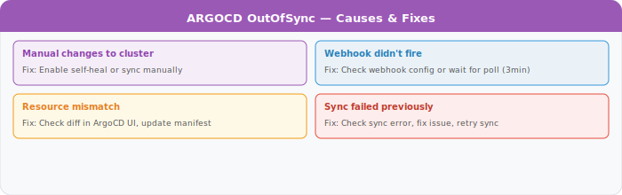

**Sync Commands:**

```bash
# Normal sync
argocd app sync my-app

# Force sync (ignore hooks)
argocd app sync my-app --force

# Sync with prune (remove extra resources)
argocd app sync my-app --prune

# Sync specific resource only
argocd app sync my-app --resource :Service:my-service
```

### 6.3 Application Stuck in "Progressing"

**Symptom:** Application health stays "Progressing" indefinitely.

**Investigation:**

```bash
# Step 1: Find what's not ready
argocd app get my-app --show-resources | grep -v Healthy

# Step 2: Check specific resource
kubectl get deployment my-app -n production
kubectl describe deployment my-app -n production

# Step 3: Check pods
kubectl get pods -n production -l app=my-app
```

**Common Causes:**

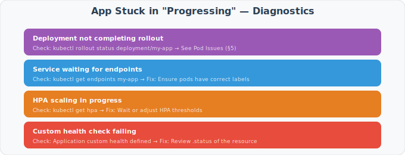

### 6.4 Cannot Login to ArgoCD

**Symptom:**

- Web UI shows "403 Forbidden"
- CLI shows "rpc error: code = Unauthenticated"

**Solutions:**

```bash
# Option 1: Get initial admin password
kubectl -n argocd get secret argocd-initial-admin-secret \
  -o jsonpath="{.data.password}" | base64 -d
echo  # Add newline

# Option 2: Reset admin password
# Generate bcrypt hash
NEW_PASS_HASH=$(htpasswd -nbBC 10 "" "newpassword" | tr -d ':\n' | sed 's/$2y/$2a/')

# Update secret
kubectl -n argocd patch secret argocd-secret \
  -p '{"stringData": {"admin.password": "'$NEW_PASS_HASH'", "admin.passwordMtime": "'$(date +%FT%T%Z)'"}}'

# Restart ArgoCD server
kubectl rollout restart deployment argocd-server -n argocd

# Option 3: Use GitHub SSO (if configured)
# Check ArgoCD ConfigMap for dex settings
kubectl get cm argocd-cm -n argocd -o yaml | grep -A 20 "dex.config"
```

### 6.5 Sync Failed with Hook Error

**Symptom:**

```text
ComparisonError: hook failed: Job ... failed
```

**Investigation:**

```bash
# Step 1: Find the failed hook
kubectl get jobs -n my-namespace | grep -E "pre|post"

# Step 2: Check job logs
kubectl logs job/my-app-pre-sync -n my-namespace

# Step 3: Check job status
kubectl describe job my-app-pre-sync -n my-namespace
```

**Solutions:**

```bash
# Fix 1: Delete failed job and retry
kubectl delete job my-app-pre-sync -n my-namespace
argocd app sync my-app

# Fix 2: Skip hooks (temporary)
argocd app sync my-app --skip-hooks

# Fix 3: Fix the hook in Git
# - Check hook's command/script
# - Ensure required secrets/config exist
# - Push fix to Git
# - Sync again
```

---

## 7. Networking Issues

### 7.1 Understanding Kubernetes Networking

> 💡 **Kubernetes Network Model**
>
> ```text
> ┌─────────────────────────────────────────────────────────────────────┐
> │                 KUBERNETES NETWORKING LAYERS                        │
> ├─────────────────────────────────────────────────────────────────────┤
> │                                                                     │
> │  LAYER 1: POD-TO-POD                                                │
> │  ─────────────────────                                              │
> │  Every pod gets a unique IP address                                 │
> │  Pods can reach any other pod by IP (no NAT)                        │
> │  Managed by: CNI plugin (Azure CNI in AKS)                          │
> │                                                                     │
> │  LAYER 2: SERVICE                                                   │
> │  ────────────────                                                   │
> │  Services provide stable DNS and load balancing                     │
> │  service-name.namespace.svc.cluster.local → Pod IPs                 │
> │  Types: ClusterIP (internal), LoadBalancer (external)               │
> │                                                                     │
> │  LAYER 3: INGRESS                                                   │
> │  ─────────────────                                                  │
> │  HTTP(S) routing from outside the cluster                           │
> │  Maps hostnames/paths to services                                   │
> │                                                                     │
> │  LAYER 4: NETWORK POLICY                                            │
> │  ─────────────────────────                                          │
> │  Firewall rules at pod level                                        │
> │  Controls which pods can communicate                                │
> │                                                                     │
> └─────────────────────────────────────────────────────────────────────┘
> ```

### 7.2 Pod Cannot Reach External Service

**Symptom:** Application timeouts when calling external APIs.

**Diagnostic Workflow:**

```bash
# Step 1: Test from inside the cluster
kubectl run debug --rm -it --image=curlimages/curl -- sh

# Inside the debug pod:
# Test DNS resolution
nslookup api.example.com

# Test connectivity
curl -v https://api.example.com

# Test with IP (bypass DNS)
curl -v https://52.x.x.x

# Exit the debug pod
exit
```

**Decision Tree:**

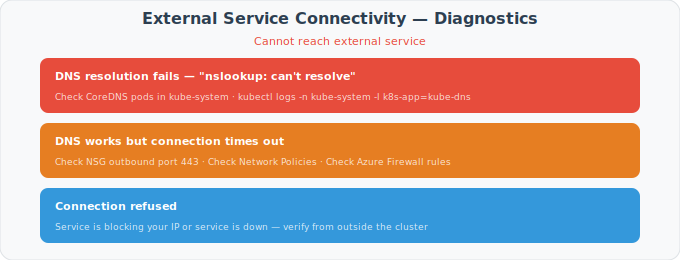

**Common Fixes:**

```bash
# Fix 1: Restart CoreDNS
kubectl rollout restart deployment coredns -n kube-system

# Fix 2: Check and update NSG
az network nsg rule list \
  --resource-group $MC_RG \
  --nsg-name aks-agentpool-xxx-nsg \
  --output table

# Add outbound rule if missing
az network nsg rule create \
  --resource-group $MC_RG \
  --nsg-name aks-agentpool-xxx-nsg \
  --name allow-https-outbound \
  --priority 200 \
  --direction Outbound \
  --access Allow \
  --protocol Tcp \
  --destination-port-ranges 443

# Fix 3: Check Network Policy
kubectl get networkpolicy -n my-namespace
kubectl describe networkpolicy my-policy -n my-namespace
```

### 7.3 Service-to-Service Communication Fails

**Symptom:** Service A cannot reach Service B within the cluster.

**Investigation:**

```bash
# Step 1: Verify Service B exists and has endpoints
kubectl get svc my-service-b -n namespace-b
kubectl get endpoints my-service-b -n namespace-b

# Step 2: Check Service B pods are running
kubectl get pods -n namespace-b -l app=my-service-b

# Step 3: Test from Service A
kubectl exec -it $(kubectl get pod -n namespace-a -l app=my-service-a -o name | head -1) \
  -n namespace-a -- wget -qO- http://my-service-b.namespace-b.svc.cluster.local
```

**Troubleshooting Matrix:**

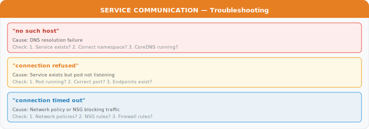

### 7.4 Private Endpoint Not Working

**Symptom:** Cannot reach Azure service (Key Vault, ACR, etc.) from within cluster.

> 💡 **How Private Endpoints Work**
>
> ```text
> WITHOUT Private Endpoint:
>   Pod → Internet → Azure Service (public IP)
>   Traffic leaves your VNet!
>
> WITH Private Endpoint:
>   Pod → VNet → Private Endpoint (private IP) → Azure Service
>   Traffic stays in VNet!
>
> For this to work:
> 1. Private endpoint must exist
> 2. Private DNS zone must be linked to VNet
> 3. DNS must resolve to private IP
> ```

**Diagnostic Steps:**

```bash
# Step 1: Check DNS resolution from inside cluster
kubectl run debug --rm -it --image=busybox -- nslookup mykeyvault.vault.azure.net

# Expected (with private endpoint):
# Name:      mykeyvault.vault.azure.net
# Address 1: 10.0.4.5  (private IP!)

# Bad (without private endpoint or misconfigured):
# Name:      mykeyvault.vault.azure.net
# Address 1: 52.x.x.x  (public IP!)

# Step 2: Check private endpoint exists
az network private-endpoint list --resource-group $RG --output table

# Step 3: Check private DNS zone
az network private-dns zone list --resource-group $RG --output table

# Step 4: Check DNS zone is linked to VNet
az network private-dns link vnet list \
  --resource-group $RG \
  --zone-name privatelink.vaultcore.azure.net \
  --output table
```

**Fixes:**

```bash
# Fix 1: Create missing DNS zone link
az network private-dns link vnet create \
  --resource-group $RG \
  --zone-name privatelink.vaultcore.azure.net \
  --name link-to-my-vnet \
  --virtual-network $VNET_ID \
  --registration-enabled false

# Fix 2: Recreate private endpoint if wrong IP
# (Usually requires Terraform apply)

# Fix 3: Verify A record in private DNS zone
az network private-dns record-set a list \
  --resource-group $RG \
  --zone-name privatelink.vaultcore.azure.net \
  --output table
```

---

## 8. External Secrets Issues

### 8.1 Understanding External Secrets

> 💡 **How External Secrets Operator (ESO) Works**
>
> ```text
> ┌─────────────────────────────────────────────────────────────────────┐
> │                 EXTERNAL SECRETS FLOW                               │
> ├─────────────────────────────────────────────────────────────────────┤
> │                                                                     │
> │  1. You create ExternalSecret resource in K8s                       │
> │                                                                     │
> │  2. ESO controller sees it                                          │
> │                                                                     │
> │  3. ESO uses ClusterSecretStore to know HOW to connect              │
> │     (Key Vault URL, authentication method)                          │
> │                                                                     │
> │  4. ESO authenticates to Key Vault using Workload Identity          │
> │                                                                     │
> │  5. ESO reads secret from Key Vault                                 │
> │                                                                     │
> │  6. ESO creates/updates Kubernetes Secret                           │
> │                                                                     │
> │  7. Your pod uses the Kubernetes Secret                             │
> │                                                                     │
> │  If ANY step fails, ExternalSecret shows "SecretSyncedError"        │
> │                                                                     │
> └─────────────────────────────────────────────────────────────────────┘
> ```

### 8.2 ExternalSecret Not Syncing

**Symptom:**

```text
kubectl get externalsecret my-secret -n my-namespace
NAME        STORE              REFRESH    STATUS
my-secret   azure-keyvault     1h         SecretSyncedError
```

**Investigation:**

```bash
# Step 1: Get detailed status
kubectl describe externalsecret my-secret -n my-namespace

# Look for:
# - "SecretSynced" condition message
# - Events section

# Step 2: Check ESO controller logs
kubectl logs -n external-secrets -l app.kubernetes.io/name=external-secrets --tail=100 | grep -i error
```

**Error Message Solutions:**

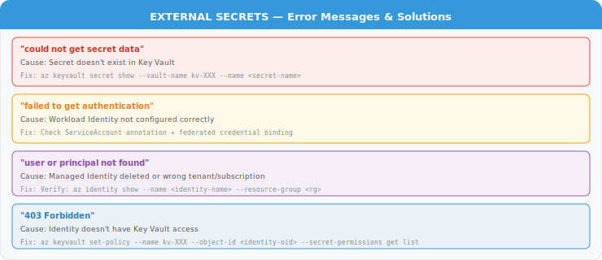

### 8.3 Secret Not Updating After Key Vault Change

**Symptom:** You updated a secret in Key Vault, but the Kubernetes Secret still has the old value.

**Understanding:**

> 💡 **Refresh Behavior**
>
> ESO doesn't sync continuously. It syncs based on `refreshInterval` in the ExternalSecret.
> Default is often 1 hour, meaning changes can take up to 1 hour to appear.

**Investigation:**

```bash
# Check refresh interval
kubectl get externalsecret my-secret -n my-namespace \
  -o jsonpath='{.spec.refreshInterval}'

# Check last sync time
kubectl get externalsecret my-secret -n my-namespace \
  -o jsonpath='{.status.refreshTime}'
```

**Solutions:**

```bash
# Option 1: Force immediate refresh
kubectl annotate externalsecret my-secret -n my-namespace \
  force-sync="$(date +%s)" --overwrite

# Option 2: Delete the K8s secret (ESO will recreate)
kubectl delete secret my-secret -n my-namespace

# Option 3: Reduce refresh interval (in ExternalSecret)
# spec:
#   refreshInterval: 5m  # Check every 5 minutes
```

### 8.4 Workload Identity Not Working

**Symptoms:**

- "AADSTS70021: No matching federated identity record found"
- "failed to acquire token"

**Diagnostic Checklist:**

```bash
# 1. Check ServiceAccount annotation
kubectl get sa external-secrets -n external-secrets -o yaml | grep -A 2 annotations

# Expected:
# annotations:
#   azure.workload.identity/client-id: "xxxxxxxx-xxxx-xxxx-xxxx-xxxxxxxxxxxx"

# 2. Check pod has required labels and volumes
kubectl get pod -n external-secrets -l app.kubernetes.io/name=external-secrets -o yaml | grep -A 5 "azure.workload.identity"

# Expected in pod spec:
# labels:
#   azure.workload.identity/use: "true"

# 3. Check federated credential in Azure
az identity federated-credential list \
  --identity-name $IDENTITY_NAME \
  --resource-group $RG \
  --output table

# Verify:
# - Subject matches: system:serviceaccount:external-secrets:external-secrets
# - Issuer matches: AKS OIDC issuer URL
```

**Fixes:**

```bash
# Fix 1: Add/fix ServiceAccount annotation
kubectl annotate sa external-secrets \
  -n external-secrets \
  azure.workload.identity/client-id=$CLIENT_ID \
  --overwrite

# Fix 2: Create missing federated credential
az identity federated-credential create \
  --identity-name $IDENTITY_NAME \
  --resource-group $RG \
  --name "external-secrets-federation" \
  --issuer $AKS_OIDC_ISSUER \
  --subject "system:serviceaccount:external-secrets:external-secrets" \
  --audiences "api://AzureADTokenExchange"

# Fix 3: Restart ESO to pick up changes
kubectl rollout restart deployment external-secrets -n external-secrets
```

---

## 9. Observability Issues

### 9.1 Prometheus Not Scraping Targets

**Symptom:** Missing metrics in Grafana dashboards.

**Investigation:**

```bash
# Step 1: Access Prometheus UI
kubectl port-forward svc/prometheus-kube-prometheus-prometheus -n observability 9090:9090

# Open http://localhost:9090/targets
# Look for DOWN targets

# Step 2: Check ServiceMonitor configuration
kubectl get servicemonitors -n observability
kubectl describe servicemonitor my-app-monitor -n observability
```

**Common Issues:**

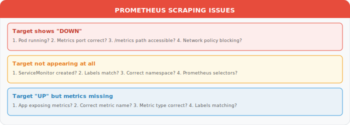

**Create ServiceMonitor Example:**

```yaml
apiVersion: monitoring.coreos.com/v1
kind: ServiceMonitor
metadata:
  name: my-app-monitor
  namespace: observability  # Where ServiceMonitor lives
  labels:
    release: prometheus     # Required for Prometheus to find it
spec:
  selector:
    matchLabels:
      app: my-app           # Must match Service labels
  namespaceSelector:
    matchNames:
      - production          # Namespace where the Service lives
  endpoints:
    - port: metrics         # Port name from Service
      path: /metrics        # Metrics endpoint path
      interval: 30s         # How often to scrape
```

### 9.2 Grafana Dashboard Not Loading

**Symptom:** Dashboard shows "No Data" or won't load.

**Diagnostic Steps:**

```bash
# Step 1: Access Grafana
kubectl port-forward svc/prometheus-grafana -n observability 3000:80

# Step 2: Test data source
# Go to: Configuration > Data Sources > Prometheus > Test

# Step 3: Check Prometheus directly
kubectl port-forward svc/prometheus-kube-prometheus-prometheus -n observability 9090:9090
# Run the same query in Prometheus UI
```

**Solutions:**

| Issue | Solution |
| ------- | ---------- |
| Data source test fails | Check Prometheus URL in data source settings |
| Query returns empty | Run query in Prometheus first to verify data exists |
| Dashboard variables broken | Check variable queries at top of dashboard |
| Time range wrong | Adjust time picker, check "now" alignment |

### 9.3 Logs Not Appearing in Azure Monitor

**Symptom:** Container logs missing in Log Analytics.

**Investigation:**

```bash
# Step 1: Check OMS agent is running
kubectl get pods -n kube-system | grep omsagent

# Step 2: Check OMS agent logs
kubectl logs -n kube-system -l component=oms-agent --tail=50

# Step 3: Verify Log Analytics workspace
az aks show -g $RG -n $CLUSTER --query "addonProfiles.omsagent"
```

**Solutions:**

```bash
# Fix 1: Re-enable Container Insights
az aks enable-addons \
  --resource-group $RG \
  --name $CLUSTER \
  --addons monitoring \
  --workspace-resource-id $WORKSPACE_ID

# Fix 2: Restart OMS agent
kubectl rollout restart daemonset omsagent -n kube-system

# Fix 3: Check if namespace is excluded
kubectl get configmap container-azm-ms-agentconfig -n kube-system -o yaml
```

---

## 10. AI Foundry Issues

### 10.1 Rate Limit Exceeded (429)

**Symptom:**

```text
Error: 429 Too Many Requests - Rate limit exceeded. Retry after X seconds.
```

> 💡 **Understanding Azure OpenAI Quotas**
>
> Azure OpenAI uses **Tokens Per Minute (TPM)** quotas.
> When you exceed your quota, requests are rejected with 429.
>
> TPM is shared across:
>
> - All requests to a deployment
> - Both input and output tokens count

**Investigation:**

```bash
# Check current deployment capacity
az cognitiveservices account deployment show \
  --name $AI_ACCOUNT \
  --resource-group $RG \
  --deployment-name gpt-4o \
  --query "properties.capacity"
```

**Solutions:**

```bash
# Option 1: Increase capacity
az cognitiveservices account deployment update \
  --name $AI_ACCOUNT \
  --resource-group $RG \
  --deployment-name gpt-4o \
  --capacity 30  # Increase TPM

# Option 2: Implement retry with backoff in your code
# Python example:
# import openai
# from tenacity import retry, wait_exponential
#
# @retry(wait=wait_exponential(min=1, max=60))
# def call_openai():
#     return client.chat.completions.create(...)

# Option 3: Spread load across multiple deployments
# Create gpt-4o-2, gpt-4o-3, etc.
```

### 10.2 Model Not Available in Region

**Symptom:**

```text
Error: Model 'gpt-4o' is not available in region 'brazilsouth'
```

**Model Availability Reference:**

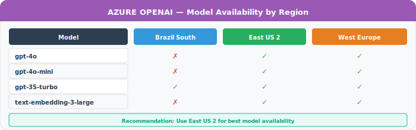

**Solution:** Deploy AI Foundry in East US 2:

```hcl
module "ai_foundry" {
  source   = "./modules/ai-foundry"
  location = "eastus2"  # Not brazilsouth
  # ...
}
```

### 10.3 Content Filter Blocked Request

**Symptom:**

```text
Error: The response was filtered due to the prompt triggering Azure OpenAI's content management policy.
```

**Understanding:**

> 💡 **Azure OpenAI Content Filtering**
>
> Azure OpenAI automatically filters:
>
> - Hate speech
> - Violence
> - Sexual content
> - Self-harm content
>
> Filters can be adjusted via Content Filter configuration.

**Solutions:**

1. Review your prompt for triggering content
2. Request content filter modification (Azure support)
3. Use system prompt to guide model toward safe responses

---

## 11. Authentication and Authorization Issues

### 11.1 Azure CLI Session Expired

**Symptom:**

```text
AADSTS700082: The refresh token has expired due to inactivity.
```

**Fix:**

```bash
# Clear and re-authenticate
az logout
az login
az account set --subscription $SUBSCRIPTION_ID

# Verify
az account show
```

### 11.2 kubectl Permission Denied

**Symptom:**

```text
Error from server (Forbidden): pods is forbidden: User "user@example.com" cannot list resource "pods" in API group "" in the namespace "default"
```

**Investigation:**

```bash
# Check your current user
kubectl auth whoami

# Check what you can do
kubectl auth can-i --list

# Check role bindings
kubectl get rolebindings,clusterrolebindings -A | grep <your-email-or-group>
```

**Solutions:**

```bash
# Option 1: Use admin credentials (temporary)
az aks get-credentials -g $RG -n $CLUSTER --admin

# Option 2: Add yourself to appropriate role
kubectl create rolebinding my-access \
  --clusterrole=view \
  --user=user@example.com \
  --namespace=default

# Option 3: Check Azure AD group membership
az ad group member list --group "AKS-Admins" --output table
```

### 11.3 Service Principal Expired

**Symptom:**

```text
AADSTS7000215: Invalid client secret provided
```

**Fix:**

```bash
# Step 1: Create new credential
az ad sp credential reset --name $SP_NAME --credential-description "New secret"

# Step 2: Update wherever it's used
# - GitHub Actions secrets
# - Azure DevOps
# - Terraform variables
# - Key Vault (if stored there)

# Step 3: Update in GitHub
gh secret set ARM_CLIENT_SECRET --body "new-secret-value"
```

---

## 12. Performance Issues

### 12.1 High API Server Latency

**Symptom:** kubectl commands are slow, workloads take long to schedule.

**Investigation:**

```bash
# Check API server latency
kubectl get --raw /metrics | grep apiserver_request_duration

# Check API server logs (in Azure Portal)
# AKS > Monitoring > Logs > Query:
# AzureDiagnostics | where Category == "kube-apiserver"
```

**Solutions:**

| Cause | Solution |
| ------- | ---------- |
| Too many watchers | Reduce custom controllers, use informers |
| Large objects | Don't store large data in ConfigMaps/Secrets |
| etcd pressure | Upgrade to Premium tier AKS |
| Too many API calls | Add caching, reduce poll frequency |

### 12.2 Slow Pod Startup

**Investigation:**

```bash
# Get pod events with timestamps
kubectl describe pod $POD_NAME | grep -A 20 Events

# Common slow phases:
# - Scheduled → Pulling: Image pull time
# - Pulling → Started: Container creation
# - Started → Ready: Readiness probe
```

**Solutions:**

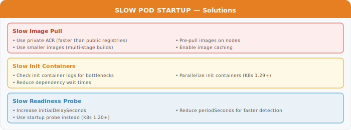

### 12.3 Memory/CPU Throttling

**Investigation:**

```bash
# Check current usage vs limits
kubectl top pods -n my-namespace

# Check for OOMKilled
kubectl get pods -n my-namespace -o jsonpath='{.items[*].status.containerStatuses[*].lastState.terminated.reason}' | grep OOMKilled

# Check throttling (requires metrics-server)
kubectl get --raw /apis/metrics.k8s.io/v1beta1/pods | jq '.items[] | select(.metadata.namespace=="my-namespace")'
```

**Solutions:**

```yaml
# Adjust resources in deployment
resources:
  requests:
    cpu: "500m"      # Guaranteed minimum
    memory: "512Mi"
  limits:
    cpu: "2000m"     # Maximum allowed
    memory: "2Gi"    # Container killed if exceeded
```

> 💡 **Resource Request vs Limit**
>
> - **Request**: What the scheduler guarantees. Pod won't start if cluster can't provide this.
> - **Limit**: Maximum the container can use. Exceeding memory = OOMKilled. Exceeding CPU = throttled.
>
> Best practice: Set request = typical usage, limit = 2-3x request.

---

## 13. Error Message Reference

### Quick Error Lookup Table

| Error Message | Likely Cause | Section |
| --------------- | -------------- | --------- |
| "connection refused" | Service not running, wrong port | 7.3 |
| "no such host" | DNS resolution failed | 7.2 |
| "timeout" | Network policy blocking, firewall | 7.2 |
| "403 Forbidden" | RBAC permission denied | 11.2 |
| "ImagePullBackOff" | Can't pull container image | 5.3 |
| "CrashLoopBackOff" | Container keeps crashing | 5.4 |
| "OOMKilled" | Out of memory | 5.4 |
| "Evicted" | Node resource pressure | 4.2 |
| "FailedScheduling" | Can't find node for pod | 5.2 |
| "QuotaExceeded" | Azure subscription limit | 3.5 |
| "state blob is already locked" | Terraform lock | 3.3 |
| "SecretSyncedError" | ESO can't sync secret | 8.2 |

---

## 14. Support and Escalation

### 14.1 When to Escalate

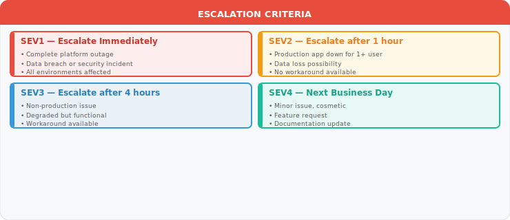

### 14.2 Information to Collect Before Escalating

```bash
#!/bin/bash
# scripts/collect-support-bundle.sh

BUNDLE_DIR="support-bundle-$(date +%Y%m%d-%H%M%S)"
mkdir -p $BUNDLE_DIR

echo "Collecting support bundle..."

# 1. Cluster info
kubectl cluster-info dump > $BUNDLE_DIR/cluster-dump.txt 2>&1

# 2. All pod statuses
kubectl get pods -A -o wide > $BUNDLE_DIR/pods.txt

# 3. All events
kubectl get events -A --sort-by='.lastTimestamp' > $BUNDLE_DIR/events.txt

# 4. Node info
kubectl describe nodes > $BUNDLE_DIR/nodes.txt

# 5. Resource usage
kubectl top nodes > $BUNDLE_DIR/top-nodes.txt 2>&1
kubectl top pods -A > $BUNDLE_DIR/top-pods.txt 2>&1

# 6. ArgoCD status
kubectl get applications -n argocd -o yaml > $BUNDLE_DIR/argocd-apps.yaml 2>&1

# 7. External Secrets status
kubectl get externalsecrets -A -o yaml > $BUNDLE_DIR/externalsecrets.yaml 2>&1

# 8. Network policies
kubectl get networkpolicies -A -o yaml > $BUNDLE_DIR/netpols.yaml

# 9. Azure resources (if az cli available)
if command -v az &> /dev/null; then
    az aks show -g $RG -n $CLUSTER > $BUNDLE_DIR/aks-info.json 2>&1
fi

# Create archive
tar -czf $BUNDLE_DIR.tar.gz $BUNDLE_DIR
rm -rf $BUNDLE_DIR

echo "Support bundle created: $BUNDLE_DIR.tar.gz"
```

### 14.3 Support Channels

| Channel | Use Case | Response Time |
| --------- | ---------- | --------------- |
| **GitHub Issues** | Bug reports, feature requests | Best effort |
| **Slack #platform-help** | Quick questions, guidance | Business hours |
| **PagerDuty** | SEV1/SEV2 incidents | 15 min (SEV1), 1 hr (SEV2) |
| **Azure Support** | Azure-specific issues | Per support plan |
| **Email: platform-team@** | General questions | 1 business day |

### 14.4 Post-Incident Documentation

After resolving an incident, document:

```markdown
# Incident Report: [Brief Description]

## Summary
- **Date/Time**: YYYY-MM-DD HH:MM UTC
- **Duration**: X hours Y minutes
- **Severity**: SEV1/2/3/4
- **Affected**: [Users/Services]

## Timeline
- HH:MM - Issue reported
- HH:MM - Investigation started
- HH:MM - Root cause identified
- HH:MM - Fix applied
- HH:MM - Normal operation confirmed

## Root Cause
[Detailed explanation of what went wrong]

## Resolution
[What was done to fix it]

## Lessons Learned
1. [What we learned]
2. [What we'll do differently]

## Action Items
- [ ] [Preventive measure 1]
- [ ] [Preventive measure 2]
```

---

## Appendix: Diagnostic Commands Cheatsheet

```bash
# ═══════════════════════════════════════════════════════════════════
# CLUSTER & NODES
# ═══════════════════════════════════════════════════════════════════
kubectl cluster-info                    # API server connectivity
kubectl get nodes -o wide               # Node status and IPs
kubectl describe node <name>            # Detailed node info
kubectl top nodes                       # Node resource usage

# ═══════════════════════════════════════════════════════════════════
# PODS
# ═══════════════════════════════════════════════════════════════════
kubectl get pods -A                     # All pods
kubectl get pods -o wide                # Pods with node info
kubectl describe pod <name>             # Detailed pod info
kubectl logs <pod> -f                   # Stream logs
kubectl logs <pod> --previous           # Previous container logs
kubectl exec -it <pod> -- /bin/sh       # Shell into pod
kubectl top pods                        # Pod resource usage

# ═══════════════════════════════════════════════════════════════════
# EVENTS
# ═══════════════════════════════════════════════════════════════════
kubectl get events --sort-by='.lastTimestamp'           # Recent events
kubectl get events --field-selector type=Warning        # Warnings only

# ═══════════════════════════════════════════════════════════════════
# SERVICES & NETWORKING
# ═══════════════════════════════════════════════════════════════════
kubectl get svc,ep -A                   # Services and endpoints
kubectl get networkpolicy -A            # Network policies
kubectl run debug --rm -it --image=busybox -- sh        # Debug pod

# ═══════════════════════════════════════════════════════════════════
# ARGOCD
# ═══════════════════════════════════════════════════════════════════
argocd app list                         # List applications
argocd app get <app>                    # App details
argocd app diff <app>                   # What's different
argocd app sync <app>                   # Sync application

# ═══════════════════════════════════════════════════════════════════
# EXTERNAL SECRETS
# ═══════════════════════════════════════════════════════════════════
kubectl get externalsecrets -A          # All external secrets
kubectl describe externalsecret <name>  # Detailed status

# ═══════════════════════════════════════════════════════════════════
# AZURE CLI
# ═══════════════════════════════════════════════════════════════════
az aks show -g $RG -n $CLUSTER          # AKS cluster info
az aks get-credentials -g $RG -n $CLUSTER  # Get kubeconfig
az network private-endpoint list -g $RG    # Private endpoints
az keyvault secret list --vault-name $KV   # Key Vault secrets
```

---

## 🤖 Using Copilot Agents for Troubleshooting

Before diving into manual troubleshooting, try asking a Copilot Agent:

<!-- markdownlint-disable MD044 -->
| Problem Area | Agent | Example Prompt |
| ------------- | ------- | --------------- |
| Pod crashes & errors | `@sre` | "Pods in namespace X are CrashLoopBackOff, help me diagnose" |
| Terraform errors | `@terraform` | "My terraform plan fails with error Y, help me fix" |
| ArgoCD sync failures | `@devops` | "ArgoCD app is stuck in Progressing, what should I check?" |
| Network connectivity | `@sre` | "Service A can't reach Service B, help me debug" |
| Security findings | `@security` | "tfsec found High severity issues, help me remediate" |
| Performance issues | `@sre` | "Latency is above SLO, help me find the bottleneck" |
<!-- markdownlint-enable MD044 -->

> **Tip:** `@sre` follows a systematic approach: **Triage → Observe → Hypothesize → Investigate → Mitigate → Root Cause**. It will walk you through each step.

---

## Related Documentation

| Document | Description |
|----------|-------------|
| [Administrator Guide](./ADMINISTRATOR_GUIDE.md) | Day-2 operations, monitoring, scaling, and maintenance |
| [Deployment Guide](./DEPLOYMENT_GUIDE.md) | Step-by-step platform deployment instructions |
| [Runbooks](../runbooks/README.md) | Operational runbooks for incident response and recovery |
| [Performance Tuning Guide](./PERFORMANCE_TUNING_GUIDE.md) | Optimization recommendations for all components |
| [Module Reference](./MODULE_REFERENCE.md) | Detailed inputs/outputs for all Terraform modules |

## Next Steps

- **Review runbooks**: See [Runbooks](../runbooks/README.md) for step-by-step operational procedures
- **Configure alerting**: Set up proactive alerting — see [Administrator Guide](./ADMINISTRATOR_GUIDE.md)
- **Review incident response**: See [Incident Response Runbook](../runbooks/incident-response.md)

---

**Document Version:** 2.0.0
**Last Updated:** March 2026
**Maintainer:** Platform Engineering Team
